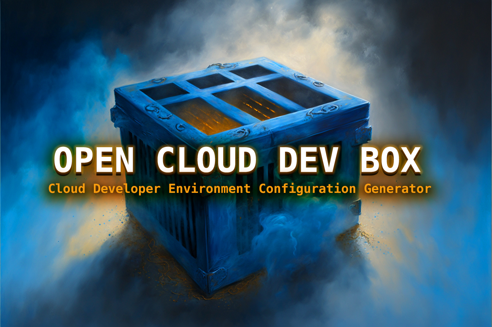

# Open Cloud Dev Box

Open Cloud Dev Box is a project that makes learning cloud faster, easier and safer. By having a preconfigured, isolated development environment based in a container, and compatible with various cloud-based development environment services like [Gitpod](http://gitpod.io/) + Codespaces you're safe to explore, play and learn the cloud without worrying about breaking your machine. Additionally, configurations include security best practices and standards. 

## Motivations

1. No more wasted time setting up your environment
2. No more broken environments (isolated environment)
3. Secure, by default (best practice security)
4. Extensible and personalisable

## Getting Started

## Getting Started

### With Gitpod

1. Create Gitpod account. 
2. [Open in Gitpod](https://gitpod.io/#github.com/openupthecloud/open-cloud-dev-box) (Or click: [gitpod.io/#https://github.com/openupthecloud/open-cloud-dev-box](https://github.com/openupthecloud/open-cloud-dev-box))
3. Type `aws` (or any other supported CLI or tool) into the terminal to verify

### With Codespaces

1. Create a GitHub account
2. Go to: github.com/codespaces and start a new Codespace based on the project
3. Type `aws` (or any other supported CLI or tool) into the terminal to verify

### Locally

Coming soon! 

## Compatibilities

Open Cloud Dev Box is intended to be configured to work across platform / standards:

1. [devcontainer.json](https://code.visualstudio.com/docs/devcontainers/containers)
2. [.gitpod.yml](https://www.gitpod.io/docs/references/gitpod-yml)
3. [devfile](https://devfile.io)
4. [Score Dev](https://score.dev)

Allowing you to make use of both cloud-based development environments + local running container-based environments. 

## Backlog / Roadmap 

### 🏔 Milestone 1: Basic setup for Cloud Bootcamp

Description: Meet requirements of Andrew Brown's Cloud Bootcamp (see [issue](https://github.com/openupthecloud/open-cloud-dev-box/issues/6), and [course outline](https://docs.google.com/document/d/19XMyd5zCk7S9QT2q1_Cg-wvbnBwOge7EgzgvtVCgcz0/edit#heading=h.wkvwyzh618s9)). Other tools can be added in future. 

**Install all necessary tools**

- [x] Setup AWS CLI and AWS Vault
- [x] Install AWS CLI (https://github.com/openupthecloud/open-cloud-dev-box/pull/7)
- [x] Install DynamodDB Local (https://github.com/openupthecloud/open-cloud-dev-box/pull/24)
- [x] Install GCP SDK (https://github.com/openupthecloud/open-cloud-dev-box/pull/25)
- [x] Install PostgreSQL (https://github.com/openupthecloud/open-cloud-dev-box/pull/25)
- [ ] SAM CLI (?)
- [ ] Honeycomb (?)
- [ ] Install DynamodDB Local (https://github.com/openupthecloud/open-cloud-dev-box/issues/16)
- [ ] Install Momento (https://github.com/openupthecloud/open-cloud-dev-box/issues/15)

**Add compatibility across main cloud providers + local**
- [ ] Add Docker base image support (https://github.com/openupthecloud/open-cloud-dev-box/issues/29)
- [x] Setup flow with Gitpod
- [ ] Setup Codespaces compatibility (https://github.com/openupthecloud/open-cloud-dev-box/issues/18)
- [ ] Setup configuration to work locally with devcontainer (https://github.com/openupthecloud/open-cloud-dev-box/issues/18)

### 🏔 Milestone 2: Improve security posture + developer experience

**Extra installations**
- [x] Install Terraform (https://github.com/openupthecloud/open-cloud-dev-box/pull/7)
- [x] Install kubectl (https://github.com/openupthecloud/open-cloud-dev-box/pull/7)

**Setup secrets management tools**
- [ ] 1Password secrets integration (https://github.com/openupthecloud/open-cloud-dev-box/issues/27)
- [ ] AWS Secrets Manager integration (https://github.com/openupthecloud/open-cloud-dev-box/issues/27)

**Developer Experience**
- [x] Add VS Code extensions (https://github.com/openupthecloud/open-cloud-dev-box/pull/20)
- [ ] Wizard Configuration Setup
- [ ] Add VS Code extensions (https://github.com/openupthecloud/open-cloud-dev-box/issues/17)
- [ ] Wizard Configuration Setup (https://github.com/openupthecloud/open-cloud-dev-box/issues/28)
- [ ] Add DevContainer support (https://github.com/openupthecloud/open-cloud-dev-box/issues/18)

### New to Cloud Development Environments? 

If you're new to Cloud Development Environments, what they are, why they exist, why companies use them, the benefits, to see where this project could go in the future, take a look at the following links and resources for some ideas. 

**Definitions**

1. [Cloud development environments (CDEs)](https://www.gitpod.io/cde)
2. [The year of the Cloud Development Environment](https://redmonk.com/jgovernor/2022/12/01/the-year-of-the-cloud-development-environment/)

**Products**

1. [Microsoft - GitHub’s Engineering Team has moved to Codespaces](https://github.blog/2021-08-11-githubs-engineering-team-moved-)
2. [Google - Introducing Cloud Workstations: Managed and Secure Development environments in the cloud
](https://cloud.google.com/blog/products/application-development/introducing-cloud-workstations)
3. [AWS - Announcing Amazon CodeCatalyst, a Unified Software Development Service](https://aws.amazon.com/blogs/aws/announcing-amazon-codecatalyst-preview-a-unified-software-development-service/)
4. [JetBrains - How To Get Started With Space Cloud Dev Environments](https://blog.jetbrains.com/space/2022/10/26/get-started-with-space-dev-environments/)

**Companies who “built their own”**

1. [Shopify - Shopifys Cloud Development Journey](https://shopify.engineering/shopifys-cloud-development-journey)
2. [Slack - Remote Development At Slack](https://slack.engineering/remote-development-at-slack/)
3. [Uber - DevPod: Improvind Developer Productivity at Uber](https://www.uber.com/blog/devpod-improving-developer-productivity-at-uber/)

### Contribute?

We are looking for contributors, for more information, see [this issue](https://github.com/openupthecloud/open-cloud-dev-box/issues/21).
